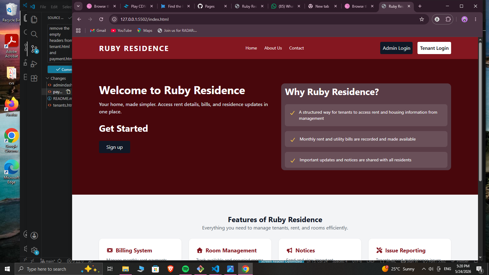
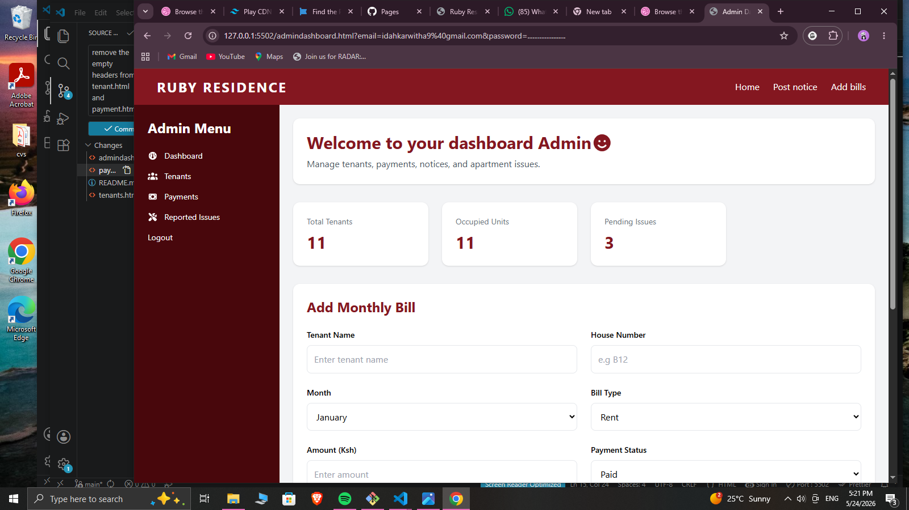
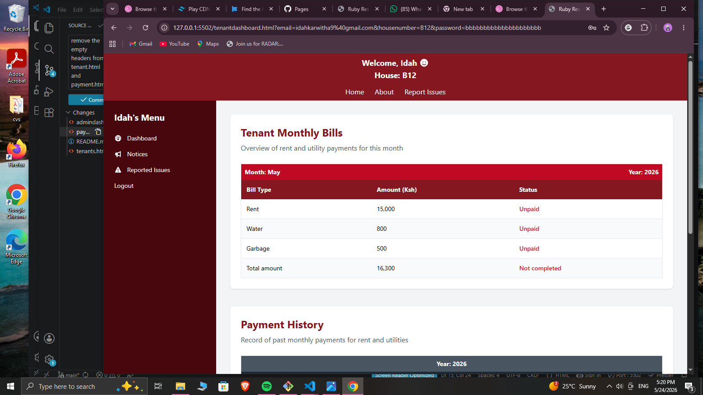

# Rubyresidence – Rental Management System
Rubyresidence is a rental management system designed to streamline communication between tenants and administrators. It allows users to access rent bills, manage room allocations, and receive important apartment notices in a clear and organized interface.

## Project Overview

This repository contains the frontend design for Ruby residence.  
The system is built to improve apartment management workflows through a clean, user-friendly interface that prioritizes accessibility, clarity, and ease of navigation.

---

## Visual Identity

The interface is designed with a modern and professional aesthetic:

- **Primary Palette:** Soft neutrals and clean backgrounds to ensure readability and simplicity
- **Accents:** Subtle highlight colors used for buttons and key actions
- **Typography:** Clean sans-serif fonts for a modern and professional appearance
- **Layout Style:** Structured grid and card-based layouts for clear content separation

---
## Current Features

- **Tenant Dashboard:** View rent bills, notices, and personal apartment details
- **Admin Dashboard:** Manage tenants, rooms, and apartment information
- **Bills Section:** Displays rent and utility breakdowns in a structured format
- **Notices Board:** Centralized announcements for tenants
- **Room Management View:** Overview of available and occupied rooms
- **Navigation System:** Simple page-based navigation using HTML links and onclick actions

---


## Tech Stack

- Language:HTML5
- Styling: Tailwind CSS 
- Interactivity: Basic JavaScript (for navigation handling)
- Vanilla JavaScript for functionality
- Jest for testing
- LocalStorage

## Getting Started

### Prerequisites
- Any modern web browser (Chrome, Firefox, Edge, Safari)

### Installation
Clone the repository:

```bash
git clone https://github.com/Idahk19/rubyresidence.git
```
## Project Structure
```
rubyresidence/
│
├── index.html
├── about.html
├── contact.html
├── tenantdashboard.html
├── admindashboard.html
├── payments.html
├── tenants.html
├── reported_issues.html
├── assets/
│ ├── css/
│ ├── js/
│ └── images/
└── README.md
```

# Coding Standards

- Use clean and semantic HTML structure  
- Maintain proper indentation and commenting  
- Follow responsive design principles  
- Keep a consistent dark fitness theme  
- Optimize images for performance  
- Ensure accessibility best practices are followed  

---
# Responsiveness

The website is fully responsive across:

- Mobile devices  
- Tablets  
- Laptops  
- Desktop screens  

Responsive techniques used include:

- Media queries  
- Flexible layouts  
- Responsive images  
- Mobile-friendly navigation  

---
## Testing

This project uses Jest for unit testing.

### What is tested:
- Authentication logic
- Bill creation and updates
- Issue management system
- Data filtering by user

### Run tests:

```bash
npm test


# Future Improvements

Potential future upgrades include:

- User authentication system  
- Backend for data storage 

---

# Setup Instructions

## Clone the Repository

```bash
git clone https://github.com/Idahk19/ruby-residence.git
```

---

## Navigate Into the Project Folder

```bash
cd ruby-reseidence
```

---

## Open the Project

You can open the project using:

```bash
code .
```

Or open `index.html` directly in your browser.

---

# GitHub Workflow

## Initialize Git

```bash
git init
```

## Add Files

```bash
git add .
```

## Commit Changes

```bash
git commit -m "Initial commit"
```

## Push to GitHub

```bash
git remote add origin https://github.com/Idahk19/ruby-residence.git
```
```bash
git branch -M main
```
```bash
git push -u origin main
```

---

##  Project Goals

Rubyresidence aims to:

- Improve communication between tenants and apartment management  
- Simplify rent tracking and payment record management  
- Provide tenants with easy access to bills and account information  
- Centralize apartment notices and important updates  
- Reduce manual paperwork and errors in tenant management  
- Improve transparency in rental and utility billing  
- Create a simple and user-friendly digital apartment system    

---
## Screenshots
### Home page


### Admin Dashboard Page


### Tenant Dashboard Page


## Live URL
```
https://ruby-residence.vercel.app/
```

## License

MIT License

## Author
Idah Karwitha

## Copyright 

&copy; 2026 Ruby Residence